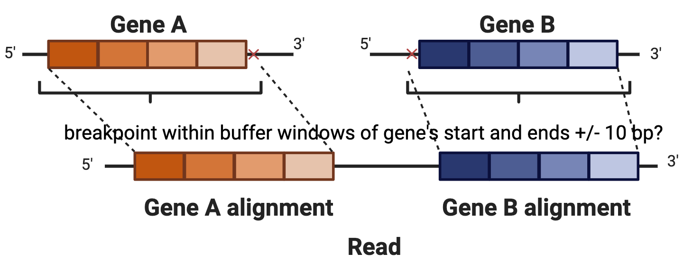

# FUSILLI


FUSILLI (**FUS**ions **I**n **L**eukemia for **L**ong-read sequencing **I**nvestigator) is a fusion caller specific for B-ALL genomic fusion subtypes based on long-read, transcriptomic sequencing.

## Overview

B-cell acute lymphoblastic (B-ALL) genomic subtypes are important prognostic measures informing downstream treatment regimens.
They are conventionally diagnosed clinical testing including immunhistochemistry assays, FISH, and cytogenetics .
NGS methods, specificaly long-read sequencing, may offer an alternative to these tests and/or provide additional insights regarding structural variations within B-ALL genomic subtypes.
Here, we present FUSILLI, a tool designed to look for fusions in long-read, transcriptomic sequencing.
We have tested the data specifically on Oxford Nanopore Technologies' long-read sequencing platforms (primarily on the MinION and GridION).
In brief, FUSILLI directly looks for candidate fusions by finding reads which align to disparate genes of interest.
Then, FUSILLI filters those fusions using a variety of different criteria (see below).
At minimum, FUSILLI requires a PAF file as input.
By default, only relevant B-ALL gene fusions are reported along with the number of supporting reads.
However, filters can be removed to create a more permissive output, even outside the context of B-ALL.
See below for more details.


## Requirements


## Installaion

The tool can be run by simply downloading/cloning this repository.

```
git clone git@github.com:jwanglab/fusilli.git
```

## Quick Start

On a command line, at minimum, you would run:

```
python fusilli.py -p <path_to_paf_file>
```

`<path_to_paf_file>`

This is the path to a PAF (pairwise mapping format), tab-delimited file generated from the alignment of long-read, transcriptomic sequencing.
See [here](https://github.com/lh3/miniasm/blob/master/PAF.md) for more details.
The PAF file name must end in the `.paf` extension.
FUSILLI output assumes the PAF file name is equivalent to the sample/sequencing id.
PAF files can be generated from long-read sequencing using [minimap2](https://github.com/lh3/minimap2).
FUSILLI assumes a **genomic** reference is used for alignment.
FUSILLI looks for alignments from the PAF file overlapping with target genes of interested in a B-ALL BED file (by default).
After assembling candidate reads mapping to disparate genes, FUSILLI applies filters to get rid of false positives, most likely due to ambiguous alignments.
By default, FUSILLI will output fusions with the number of unique supporting reads to `stdout`:

```
analyzing the PAF file at /home/jclin/sample.paf: 100%|████████████████████████████████████████████████████████████████████| 6515299/6515299 [01:09<00:00, 94064.51it/s]

---------------------------
 FUSILLI Fusion Detection
---------------------------
('ETV6', 'RUNX1') 155.0

finished!
```

For both PAF and BED files (described below), chromsome names should correspond to RefSeq format ie NC_000001.11, NC_000002.12, NC_000003.12...etc.


## Optional Arguments

1. `-b, --bed`

BED (browser extensible data, extension `.bed`), tab-delimited file including the target genes of interest.
The required columns of the BED file are `chromosome`, `genomic_start_position`, `genomic end position`, `gene name`.
The default BED file contains genes relevant to B-ALL.


BED File Example:

```
NC_000009.12	130663881	130937675	ABL1
NC_000001.11	179049327	179279684	ABL2
...
```

2. `-fm, --fusionmaster`

The fusion master is a tab-delimited text ie `.txt` file containing the list of gene fusions to consider.
It should have two columns.
Each row is a different gene fusion, and each column is a gene partner.
The order of genes listed does not matter.
The default fusion master pertains to B-ALL gene fusions.

Fusion Master Example:

```
ABL1  BCR
ETV6  RUNX1
...
```

If you would like to consider all possible gene pairs from the BED file, you can ignore the fusion master by including the `-nfm, --no_fusion_master` option.


3. `-o, --outpath: default:<None>`

If provided, `-o` points to a directory where output should be written.
FUSILLI will automatically generate a file named with the prefix on the PAF file name and ending in '_fusilli.txt'.

Sample `_fusilli.txt` file:

```
CRLF2	P2RY8	20
PAX5	ZCCHC7	14
```

where the first two columns represent partner genes and the third column is the number of distinct supporting reads.

4. `-a, --anchor: default=50`

FUSILLI first looks for reads that overlap with a target gene by at least `-a` specified bp.


5. `-mxg, --maxgap: default=30` and `-mxo, --maxoverlap: default=50`

 `-mxg` and `-mxo` define the maximum gap and maximum overlap (bp) between alignments on a given read, respectively.


6. `-mxgo, --maxgapoverlap: default=10`

If target genes are on the same chromosome, they must not overlap by this amount (bp).


7. `-bpw, --bpwin`

Inferred breakpoints must be within the gene boundaries with buffer window of +/- `-bpw` bp.


8. `-qmo, --qmaxoverlap: default=40`

If the targets overlap, the alignments must not overlap more than this percentage with respect to both alignments.



9. `-nf, --no_filt`

Including this flag will ignore all the above filters for a more permissive output of detected fusions.

10. `-mnc, --mincount: default=2`

There must be at least this number of supporting reads to call a fusion.

11. `-r, --report`

Including this flag will additionally output a data frame with all reads and columns for calculated metrics of filters described above along with whether each read passes criteria, represented by TRUE (pass) or FALSE (failed) values.
The report will print to `stdout` if the `-o, --outpath` is not supplied.
If `-o, --outpath` is supplied, the dataframe will output to a tab-delimited, file in the specified directory ending in `_fusilli_read_summary.txt`
See below for more details.


