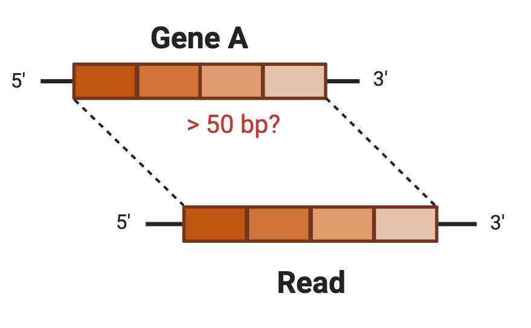
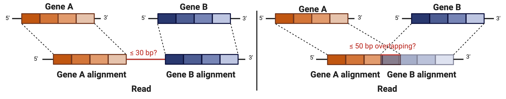
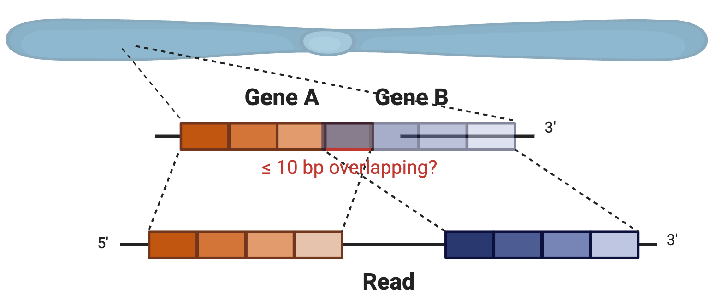
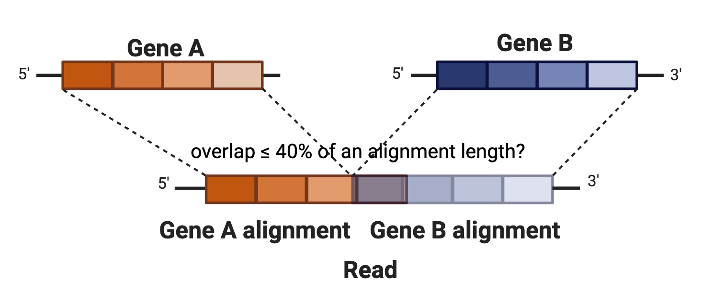
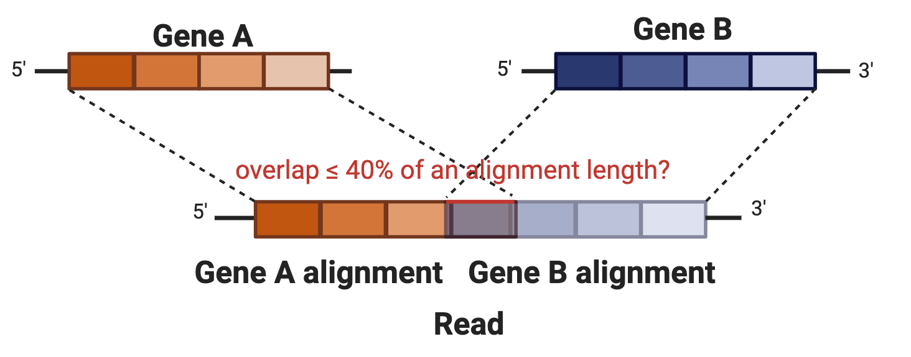

# FUSILLI


FUSILLI (**FUS**ions **I**n **L**eukemia for **L**ong-read sequencing **I**nvestigator) is a fusion caller specific for B-ALL genomic fusion subtypes based on long-read, transcriptomic sequencing.

## Overview

B-cell acute lymphoblastic (B-ALL) genomic subtypes are important prognostic measures informing downstream treatment regimens.
They are conventionally diagnosed through clinical testing including immunhistochemistry assays, FISH, and cytogenetics.
NGS methods, specifically long-read sequencing, may offer an alternative to these tests and/or provide additional insights regarding structural variations within B-ALL genomic subtypes.
Here, we present FUSILLI, a tool designed to look for fusions in long-read, transcriptomic sequencing.
We have tested the data specifically on Oxford Nanopore Technologies' long-read sequencing platforms (primarily on the MinION and GridION).
In brief, FUSILLI directly looks for candidate fusions by finding reads which align to disparate genes of interest.
Then, FUSILLI filters those fusions using a variety of different criteria (see below).
At minimum, FUSILLI requires a PAF file as input.
By default, only relevant B-ALL gene fusions are reported along with the number of supporting reads.
However, filters can be removed to create a more permissive output, even outside the context of B-ALL (for purposes of other disease contexts and/or discovery of novel fusions).
See below for more details.


## Requirements

* [anaconda](https://docs.anaconda.com/anaconda/install/) to create conda environments
* [python](https://www.python.org/) (FUSILLI known to work with version `3.12.9`)

## Installation

1. The tool can be run by first downloading/cloning this repository.

```
git clone git@github.com:jwanglab/fusilli.git
```

Change directory so that you are now in the cloned github repo.

```
cd <path_to_fusilli_github_repo>
```

2. Next, create and activate a conda environment and install the required dependencies as shown below:

```
conda create -n fusilli
conda activate fusilli
conda install pip
pip install -r requirements.txt
```

## Quick Start

After following the installlation steps above and activating the fusilli conda environment...

```
conda activate fusilli
```

...on a command line, at minimum, you would run:

```
python fusilli.py -p <path_to_paf_file>
```

`<path_to_paf_file>`

This is the path to a PAF (pairwise mapping format), tab-delimited file generated from the alignment of long-read, transcriptomic sequencing.
See [here](https://github.com/lh3/miniasm/blob/master/PAF.md) for more details.
The PAF file name must end in the `.paf` extension.
FUSILLI output assumes the PAF file name is equivalent to the sample/sequencing id.
PAF files can be generated from long-read sequencing using [minimap2](https://github.com/lh3/minimap2) (using a reference **genome**...`minimap2 -cx splice ${ref_genome_path} ${sample_fastq} > ${sample_paf}`).
FUSILLI assumes a **genomic** reference is used for alignment.
FUSILLI looks for alignments from the PAF file overlapping with target genes of interest in a B-ALL BED file (by default).
After assembling candidate reads mapping to disparate genes, FUSILLI applies filters to get rid of false positives, most likely due to ambiguous alignments.
FUSILLI will output fusions with the number of unique supporting reads to `stdout` (but also has the option to additionally output to a file).

Sample Output:

```
analyzing the PAF file at /home/jclin/sample.paf: 100%|████████████████████████████████████████████████████████████████████| 6515299/6515299 [01:09<00:00, 94064.51it/s]

---------------------------
 FUSILLI Fusion Detection
---------------------------
('ETV6', 'RUNX1') 155.0

finished!
```

For both PAF and BED files (described below), chromosome names should correspond to RefSeq format ie NC_000001.11, NC_000002.12, NC_000003.12...etc.


## Optional Arguments

1. `-b, --bed`

BED (browser extensible data, extension `.bed`), tab-delimited file including the target genes of interest.
The required columns of the BED file are `chromosome`, `genomic_start_position`, `genomic_end_position`, `gene_name`.
The default BED file contains genes relevant to B-ALL.


BED File Example:

```
NC_000009.12	130713042	130887675	ABL1
NC_000001.11	179099329	179229677	ABL2
...
```

2. `-fm, --fusionmaster`

The fusion master is a tab-delimited text ie `.txt` file containing the list of gene fusions to consider.
It should have two columns.
Each row is a different gene fusion, and each column is a gene partner.
The order of genes listed does not matter.
The default fusion master pertains to B-ALL gene fusions.

Fusion Master Example:

```
ABL1  BCR
ETV6  RUNX1
...
```

If you would like to consider all possible gene pairs from the BED file, you can ignore the fusion master by including the `-nfm, --no_fusion_master` option.


3. `-o, --outpath: default:<None>`

If provided, `-o` points to a directory where output should be written.
FUSILLI will automatically generate a file named with the prefix on the PAF file name and ending in '_fusilli.txt'.

Sample `_fusilli.txt` file:

```
sample_123	CRLF2	P2RY8	20
sample_123	PAX5	ZCCHC7	14
```

where the first column is the sample name, columns two and three represent partner genes and the fourth column is the number of distinct supporting reads.
Columns are tab-separated.

4. `-a, --anchor: default=50`

FUSILLI first looks for reads that overlap with a target gene by at least `-a` specified bp.



5. `-mxg, --maxgap: default=30` and `-mxo, --maxoverlap: default=50`

 `-mxg` and `-mxo` define the maximum gap and maximum overlap (bp) between alignments on a given read, respectively.



6. `-mxgo, --maxgapoverlap: default=10`

If target genes are on the same chromosome, they must not overlap by this amount (bp).



7. `-bpw, --bpwin`

Inferred breakpoints must be within the gene boundaries with buffer window of +/- `-bpw` bp.



8. `-qmo, --qmaxoverlap: default=40`

If the targets overlap, the alignments must not overlap more than this percentage with respect to both alignments.



9. `-nf, --no_filt`

Including this flag will ignore all the above filters for a more permissive output of detected fusions.

10. `-mnc, --mincount: default=2`

There must be at least this number of supporting reads to call a fusion.

11. `-r, --report`

Including this flag will additionally output a data frame with **all** reads (regardless if they pass filtering criteria) and columns for calculated metrics of filters described above along with whether each read passes criteria, represented by TRUE (pass) or FALSE (failed) values.
The `-o, --outpath` MUST be supplied to access the report.
The dataframe will output to a tab-delimited, file in the specified directory ending in `_fusilli_read_summary.txt`
See below for more details.

12. `-pr, --prefix`

If included, the specified string here will override the default prefix (as in the supplied PAF file) and will be used instead as the prefix for output files (`_fusilli.txt` and/or `_fusilli_read_summary.txt` and/or `_filtered.paf` files).

13. `-ofp, --output_filtered_paf`

If included, FUSILLI will output a filtered PAF file, filtered to the fusion-supporting reads (only reads which pass filtering criteria as specified).
The filtered PAF file could be used for fusion visualization in https://jwanglab.org/fusion/ and would be faster to process.

## FUSILLI Tutorial

For this tutorial, let's look at sample with a known fusion, ETV6::RUNX1, determined through conventional clinical testing.
ETV6::RUNX1 results from a balanced translocation between chromosomes 12 and 21 (t(12;21)(p13;q22)).

The sample PAF we will be using is located at `./sample_data/ETV6_RUNX1.paf` within this repo.

After installing FUSILLI, change your directory to the cloned github repository and run the below:

```
python fusilli.py -p ./sample_data/ETV6_RUNX1.paf
```

FUSILLI will start processing the PAF file and show a progress bar as the PAF file is analyzed.
After processing, FUSILLI outputs the below:

**Sample Output**

```
analyzing the PAF file at ./sample_data/ETV6_RUNX1.paf...: 100%|████████████████████████████████████████████████████████████████████| 6515299/6515299 [01:09<00:00, 94064.51it/s]

---------------------------
 FUSILLI Fusion Detection
---------------------------
('ETV6', 'RUNX1') 16

finished!
```

### Changing default parameters

Now, let's look at a file where the BCR::ABL1 fusion could not be detected in a sample confirmed to have this fusion...

If we run the below in terminal:

```
python fusilli.py -p ./sample_data/BCR_ABL1.paf
```

we get:

```
analyzing the PAF file at ./sample_data/BCR_ABL1.paf...: 100%|███████████████████████████████████████████████████████████████████| 1966884/1966884 [00:17<00:00, 114043.29it/s]

---------------------------
 FUSILLI Fusion Detection
---------------------------
No fusions detected!

finished!
```

No fusions were detected.
This could be due to a number of reasons.
FUSILLI performs well with samples sequenced at high depth on the order of 10M reads/sample.
Since it requires a minimum of 2 fusion-supporting reads to call a fusion, let's change that parameter.
Perhaps there is only 1 supporting read.
Let's change the number of minimum supporting reads from 2 to 1.

```
python fusilli.py -p ./sample_data/BCR_ABL1.paf -mnc 1
```

Running the above outputs the below (note the order genes are listed in the fusion gene pair is alphabetized for standard naming convention):

```
analyzing the PAF file at ./sample_data/BCR_ABL1.paf...: 100%|██████████████████████████████████████████████████████████████████████████████████████████████████████████████████████████████████████████████████████████████████████████| 6177/6177 [00:00<00:00, 142328.59it/s]

---------------------------
 FUSILLI Fusion Detection
---------------------------
('PAX5', 'ZCCHC7') 1.0
('ABL1', 'BCR') 1.0

finished!
```

As you can see, this sample does have 1 supporting read for BCR::ABL1.
More sequencing depth may be needed to confirm this result.

Is there another way to make the caller more permissive?
Or perhaps you want to know how to get some assistance on the caller without this documentation...run the below!

```
python fusilli.py --help
```

The help text will show a description of the tool along with descriptions of each argument.
As shown, the `-nf` option will ignore filters.
Let's try it out in combination with `-mnc 1` using the same sample as before!

```
python fusilli.py -p ./sample_data/BCR_ABL1.paf -mnc 1 -nf
```

we get (note fusions are sorted by descending counts):

```
analyzing the PAF file at ./sample_data/BCR_ABL1.paf...: 100%|██████████████████████████████████████████████████████████████████████████████████████████████████████████████████████████████████████████████████████████████████████████| 6177/6177 [00:00<00:00, 142969.49it/s]

---------------------------
 FUSILLI Fusion Detection
---------------------------
('CRLF2', 'P2RY8') 16
('BCL2', 'IGH') 2
('PAX5', 'ZCCHC7') 1
('ABL1', 'BCR') 1
('IGH', 'P2RY8') 1

finished!
```

Additionally, we can ignore the fusion master with `-nfm`.
This could be useful for discovering novel fusions.
Doing so results in the below with even more results.

```
python fusilli.py -p ./sample_data/BCR_ABL1.paf -mnc 1 -nf -nfm
```

```
analyzing the PAF file at ./sample_data/BCR_ABL1.paf...: 100%|██████████████████████████████████████████████████████████████████████████████████████████████████████████████████████████████████████████████████████████████████████████| 6177/6177 [00:00<00:00, 141226.13it/s]

---------------------------
 FUSILLI Fusion Detection
---------------------------
('CRLF2', 'P2RY8') 16
('BCL2', 'IGH') 2
('ETV6', 'TAF15') 1
('ABL1', 'SSBP2') 1
('AUTS2', 'IGH') 1
('AUTS2', 'BCL2') 1
('PAX5', 'ZCCHC7') 1
('ABL1', 'BCR') 1
('AUTS2', 'ZC3HAV1') 1
('CSF1R', 'ETV6') 1
('AFF1', 'ATF7IP') 1
('BCL2', 'CRLF2') 1
('IGH', 'P2RY8') 1

finished!
```

Above shows many possible fusions, most of which are likely a result of ambiguous alignments.
Since no filters were applied, the most permissive case was applied and FUSILLI outputs all possible fusions from the default BED file.

Let's say you want to look at what specific criteria was met for reads spanning the fusions above.
As mentioned previously, you can include the `-r` option to output a report.
Let's do that in conjunction with `-o ./` to output results to `./` ie current directory.


```
python fusilli.py -p ./sample_data/BCR_ABL1.paf -mnc 1 -nf -nfm -r -o ./
```

FUSILLI will output:

* `xx_fusilli.txt` which shows the fusions and read counts in a tab-delimited file, where `xx` is the sample name.
* `xx_fusilli_read_summary.txt` which is a data frame of all reads and filtering criteria.

Let's look at a sample line from `xx_fusilli_read_summary.txt`:


gene0 | gene1 | chr0 | chr1 | fusion | read_query | read_length | aln_dist_rd | aln_dist_rd_tf | target_dist | target_dist_tf | ovlp_perc_aln0 | ovlp_perc_aln0_tf | ovlp_perc_aln1 | ovlp_perc_aln1_tf | aln0_bp | aln0_bp_win_tf | aln1_bp | aln1_bp_win_tf | in_fus_mast_tf | overall_filt_tf | ct | ct_tf | overall_tf
------ | ------ | ------ | ------ | ------ | ------ | ------ | ------ | ------ | ------ | ------ | ------ | ------ | ------ | ------ | ------ | ------ | ------ | ------ | ------ | ------ | ------ | ------ | ---
AUTS2 | PAX5 | 6 | 8 | ('AUTS2', 'PAX5') | a59b3c61-8989-4712-a4d5-7e71f5d2d3c4 | 2191 | -353 | FALSE |  | TRUE | -56.38977636 | TRUE | -60.34188034 | TRUE | 70741704 | TRUE | 37036630 | TRUE | TRUE | FALSE | 1 | FALSE | FALSE

Each column is explained below:

|column_name|definition|
|------ | ------ |
|gene0|partner gene corresponding to the first alignment (`aln0`) processed on the read|
|gene1|partner gene corresponding to the second alignment (`aln1`) processed on the read|
|chr0|chromosome number of gene0|
|chr1|chromosome number of gene1|
|fusion|the alphabetically-standardized fusion name|
|read_query|the read id in the PAF file|
|read_length|the read length in bp|
|aln_dist_rd|The distance in bp between alignments on a read corresponding to `-mxg, --maxgap` and `-mxo, --maxoverlap` filters. Positive numbers represent overlap and negative numbers represent separation.|
|aln_dist_rd_tf|boolean if it passes (TRUE) or fails  (FALSE) the `-mxg, --maxgap` and `-mxo, --maxoverlap` filters. If alignments overlap, the aln_dist_rd distance is converted to a positive number (on the backend) and must be <= `--maxoverlap` to pass.|
|target_dist|If gene targets are on the same chromsome, this is the amount in bp they overlap. This corresponds to the `-mxgo, --maxgapoverlap` filter. Positive numbers represent overlap and negative numbers represent separation. If the gene targets are on separate chromosomes, nothing is populated in this column.|
|target_dist_tf|boolean if it passes (TRUE) or fails  (FALSE) the `-mxgo, --maxgapoverlap` filter. If overlapping, `target_dist` must be <= `maxgapoverlap` to pass. If alignments are separated, this automatically returns TRUE.|
|ovlp_perc_aln0|The % of the overlapping alignment portion with respect to `aln0`. If negative, the alignments are separated.|
|ovlp_perc_aln0_tf|boolean that returns TRUE if `ovlp_perc_aln0` <= `qmaxoverlap` in the overlapping case. If separated, this automatically returns TRUE.|
|ovlp_perc_aln1|The % of the overlapping alignment portion with respect to `aln1`. If negative, the alignments are separated.|
|ovlp_perc_aln1_tf|boolean that returns TRUE if `ovlp_perc_aln1` <= `qmaxoverlap` in the overlapping case. If separated, this automatically returns TRUE.|
|aln0_bp|The inferred breakpoint position of gene0.|
|aln0_bp_win_tf|boolean if the gene0 breakpoint is within the breakpoint window per the `-bpw, --bpwin` argument.|
|aln1_bp|The inferred breakpoint position of gene1.|
|aln1_bp_win_tf|boolean if the gene1 breakpoint is within the breakpoint window per the `-bpw, --bpwin` argument.|
|in_fus_mast_tf|boolean if the detected fusion resides in the fusion master per `-fm, --fusionmaster`. Returns TRUE if it exists and FALSE if it does not. Defaults to TRUE if no fusion master is provided through the `-nfm, --no_fusion_master` argument.|
|overall_filt_tf|boolean if it passed all read calculated filters (`aln_dist_rd_tf`, `target_dist_tf`, `ovlp_perc_aln0_tf`, `ovlp_perc_aln1_tf`, `aln0_bp_win_tf`, `aln1_bp_win_tf`). If `-nf, --no_filt` is used, this defaults to TRUE.|
|ct|The number of passing supporting reads ie those reads with `overall_filt_tf` == TRUE.|
|ct_tf|boolean returning TRUE if the number of passing supporting reads are >= `-mnc, --mincount`.|
|overall_tf|boolean returning TRUE if the read is TRUE for `overall_filt_tf`, `in_fus_mast_tf`, and, `ct_tf`. This is the final flag used to determine fusions returned from FUSILLI.|


